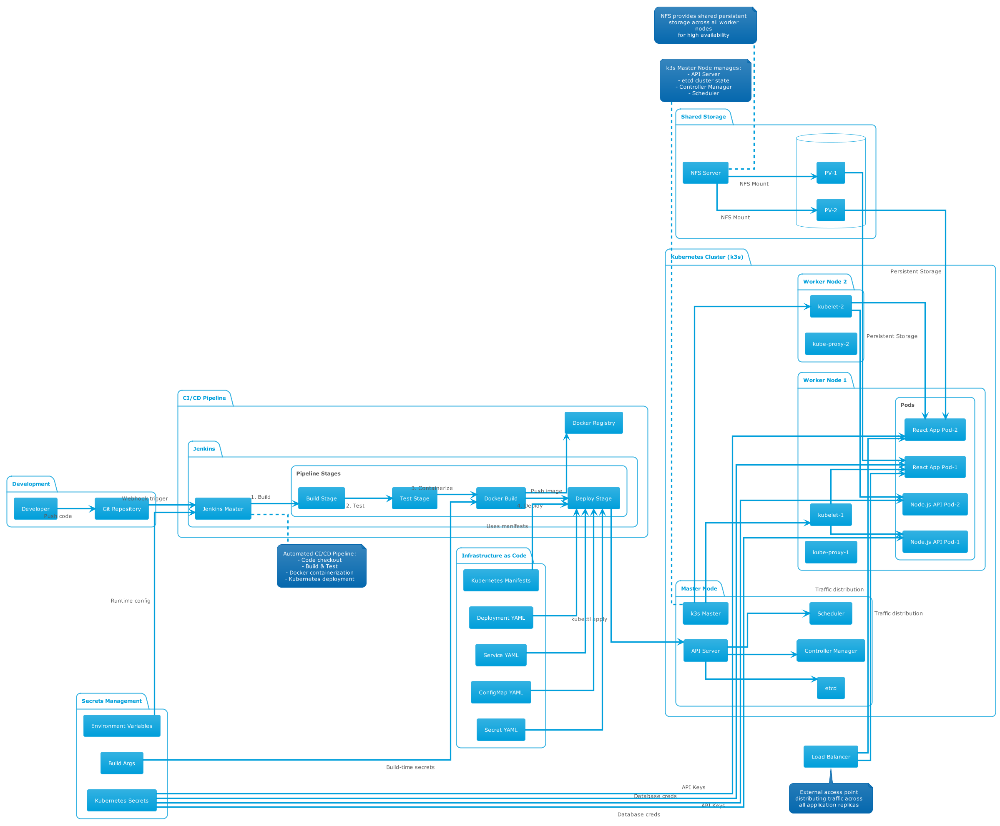

# k3s-cd

# CI/CD with Multi-Node Kubernetes Cluster

This project demonstrates a complete CI/CD pipeline for deploying a web application to a multi-node Kubernetes cluster. It showcases best practices in automation, containerization, and scalable cloud-native deployments.

## Key Components:

- **Development Flow:** Developer → Git → Jenkins webhook trigger
- **CI/CD Pipeline:** 4-stage Jenkins pipeline (Build → Test → Docker → Deploy)
- **k3s Cluster:**
   - 1 Master node with control plane components
   - 3 Worker nodes with kubelet and kube-proxy
   - Pods distributed across workers for high availability
- **NFS Storage:** Shared persistent storage mounted on all nodes
- **Infrastructure as Code:** Kubernetes manifests for deployment
- **Secrets Management:** Multiple layers (build args, env vars, k8s secrets)

## Architecture Highlights:
- **High Availability:** Multi-node setup with pod replication
- **Scalability:** Horizontal pod scaling across worker nodes
- **Persistent Storage:** NFS-backed persistent volumes
- **Security:** Proper secrets management at build and runtime
- **Automation:** Full CI/CD pipeline from code to deployment


## Project Overview
- **Web Application:** A Node.js/React app built and containerized using Docker.
- **CI/CD Pipeline:** Automated with Jenkins, including build, test, and deployment stages.
- **Kubernetes Cluster:** Multi-node setup (using k3s) for high availability and scalability.
- **Infrastructure as Code:** Kubernetes manifests for deployment and service management.
- **Secrets Management:** Secure handling of sensitive data (e.g., API keys) via build-time arguments and environment variables.

## Components

### 1. Web Application
- Source code located in `app-src/k3s-web-app`.
- Built with Node.js and served via Nginx in production.
- Dockerized for consistent deployment.

### 2. Docker
- Multi-stage Dockerfile for efficient builds and small production images.
- Build-time secrets (e.g., `GEMINI_API_KEY`) passed securely.

### 3. Jenkins CI/CD
- Automated pipeline for:
  - Building Docker images
  - Running tests
  - Pushing images to a container registry
  - Deploying to Kubernetes
- Integrates with GitHub for source control and triggers.

### 4. Kubernetes (k3s)
- Multi-node cluster for real-world scalability.
- Manifests for deployments and services (see `node-red.yaml` and others).
- ClusterIP and other service types for internal/external access.

### 5. Node-RED (Optional)
- Example of deploying additional services (see `node-red.yaml`).
- Demonstrates extensibility of the cluster.

## Pipeline Architecture



## Getting Started
1. **Clone the repository**
2. **Build and push Docker images** (via Jenkins or manually)
3. **Apply Kubernetes manifests** to your k3s cluster:
   ```sh
   kubectl apply -f node-red.yaml
   # ...other manifests
   ```
4. **Access the application** via the service endpoint.

## Highlights
- End-to-end automation from code commit to production deployment
- Secure and efficient container builds
- Scalable, resilient multi-node Kubernetes setup
- Easy extensibility for additional services

---

Feel free to explore the code and pipeline scripts to see how each component is integrated!
